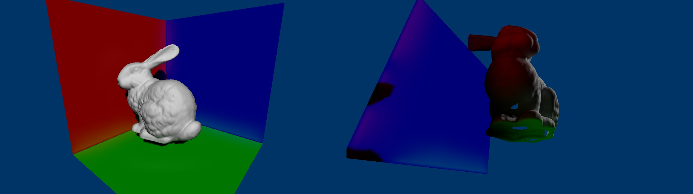
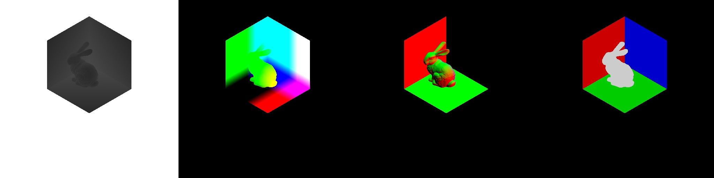

# PaperDemos

## Reflective Shadow Map [Dachsbacher and Stamminger 2005]

[Dachsbacher, C. and Stamminger, M. 2005. Reflective shadow maps. Proceedings of the 2005 symposium on Interactive 3D graphics and games, Association for Computing Machinery, 203–231.
](https://dl.acm.org/doi/10.1145/1053427.1053460)

### Result

Using DX12 + Win32.

Camera views:

RSM textures (left to right: depth, world position, normal, projected flux):

